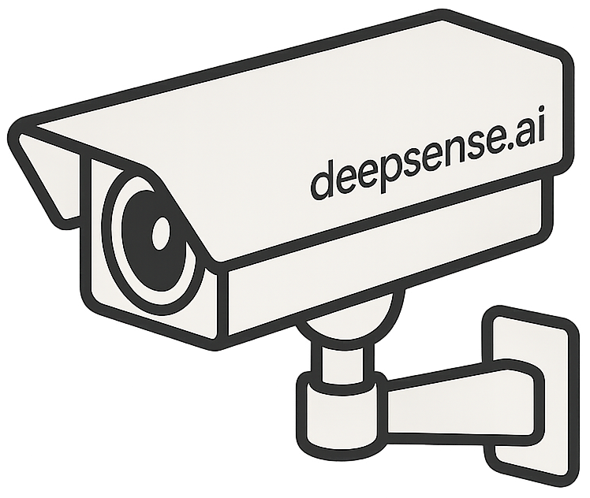

<div align="center">

<h1>GenAI Monitor 
</h1>

<p align="center">
  <em size="">Observability for Generative AI</em>
</p>

</div>


<div align="center">

<a href="https://pypi.org/project/ragbits" target="_blank">
  
</a>

<a href="https://pypi.org/project/ragbits" target="_blank">
  
</a>

<a href="https://pypi.org/project/ragbits" target="_blank">
  
</a>

</div>
TODO: change above to genai-monitor

## Overview

GenAI Monitor provides robust observability tools for Generative AI applications with zero additional effort. Simply import the library, and it automatically monitors, tracks, and analyzes your AI model's inputs, outputs, and performance in production environments - no code changes required to your existing AI workflows.

The library seamlessly integrates with popular AI frameworks and automatically captures model calls, stores responses for later retrieval without requiring you to modify your application code.


## Features

- **Implicit Observability for Popular Frameworks**: Works out-of-the-box with
most popular frameworks and providers without any code changes: Transformers, Diffusers, OpenAI, LiteLLM

- **Persistent Data Storage & Retrieval**: Store model inputs and outputs so identical calls can be retrieved from the database without re-running expensive and time consuming model inference.

- **Custom Function & Method Registration**: Easily extend monitoring to any GenAI tool. The flexible registration system allows you to monitor any Python function or method with minimal configuration.

- **Artifact Tracking**: Attach metadata and artifacts to model calls for comprehensive traceability.
- **Modular Installation**: Install only what you need to keep your dependencies lean.


## Installation
To start tracking your GenAI models, install the `genai-monitor` package:

```sh
pip install genai-monitor
```

Install with support for specific frameworks:

```sh
# HuggingFace Transformers
pip install genai-monitor[transformers]

# Diffusers
pip install genai-monitor[diffusers]

# OpenAI
pip install genai-monitor[openai]

# LiteLLM
pip install genai-monitor[litellm]
```


## Quick Start


GenAI Monitor automatically intercepts calls to supported frameworks. When you make the second API call with identical parameters, GenAI Monitor retrieves the cached response directly from the database instead of sending another request to OpenAI - saving time, reducing costs, and decreasing latency. This all happens transparently without any changes to your application code - simply import the library and it works!


```python
import os

# Import genai_monitor.auto to automatically enable monitoring
# for supported frameworks with zero code changes
import genai_monitor.auto
from openai import OpenAI

api_key = os.getenv("OPENAI_API_KEY")
client = OpenAI(api_key=api_key)
question = "How hard is to create a monitoring framework for GenAI models?"

# First API call - This request is sent to OpenAI and the result is stored in the database
response = client.chat.completions.create(
    messages=[{"role": "user", "content": question}],
    model="gpt-4o-mini-2024-07-18",
    max_tokens=400,
    temperature=0.4,
)
print(response.choices[0].message.content)

# Second API call with identical parameters -
# NO request is sent to OpenAI! Instead, the result is retrieved from the local database
response = client.chat.completions.create(
    messages=[{"role": "user", "content": question}],
    model="gpt-4o-mini-2024-07-18",
    max_tokens=400,
    temperature=0.4,
)
print(response.choices[0].message.content)
# The application code remains unchanged, but you save time and API costs
```

## Future Work
GenAI Monitor is under active development. Here are some of the exciting features on our roadmap:

- [ ] Expanded Cloud Provider Integration
- [ ] Vector Database Integration
- [ ] Extensive Query Language

## Documentation

* [Quickstart](./quickstart/auto_mode.md)
* [How-to guides](./index.md)
* [API reference](./api_reference/index.md)

## Contributing

Contributions are welcome! Please see [CONTRIBUTING.md](../CONTRIBUTING.md) (todo: add link) for details on how to contribute to this project.

## License

This project is licensed under the MIT License - see the [LICENSE.md](../LICENSE.md) (#TODO: add link + check license) file for details.
